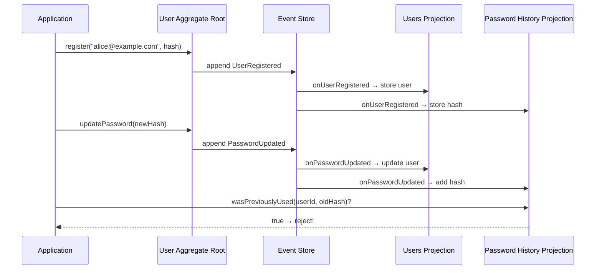

import { Aside } from '@astrojs/starlight/components';

This guide walks through a practical use case from scratch: a **User Management** system that supports registration, password changes, and enforces a "no password reuse" policy — all powered by Event Sourcing.

By the end you will have:

- A **User** aggregate root with events and commands
- An **in-memory event store** for simplicity
- A **Users projection** (read model) for querying users
- A **Password History projection** that tracks past password hashes to prevent reuse

---

## 1. The User Aggregate Root

The aggregate root is the heart of the domain. It accepts commands, validates business rules, and emits events.

<Aside type="caution">
  Never store raw passwords in events. Always hash them **before** passing them into a command.
</Aside>

```typescript
// user.ts
import { createAggregateRoot } from '@requence/event-sourcing'
import { z } from 'zod/v4'

export default createAggregateRoot('user')
  .withInitialState({
    id: null as string | null,
    email: null as string | null,
    passwordHash: null as string | null,
  })
  .withEvents({
    UserRegistered: z.object({
      email: z.email(),
      passwordHash: z.string(),
    }),
    PasswordUpdated: z.object({
      passwordHash: z.string(),
    }),
  })
  .withEventHandlers((state) => ({
    onUserRegistered({ streamId, payload }) {
      state.id = streamId
      state.email = payload.email
      state.passwordHash = payload.passwordHash
    },
    onPasswordUpdated({ payload }) {
      state.passwordHash = payload.passwordHash
    },
  }))
  .withCommands((state, event) => ({
    register(email: string, passwordHash: string) {
      if (state.id) throw new Error('User already registered')
      return event('UserRegistered', { email, passwordHash })
    },
    updatePassword(passwordHash: string) {
      if (!state.id) throw new Error('User does not exist')
      if (state.passwordHash === passwordHash) {
        throw new Error('New password must be different from the current password')
      }
      return event('PasswordUpdated', { passwordHash })
    },
  }))
```

### What's happening here?

1. **`UserRegistered`** captures the email and the hashed password at registration time.
2. **`PasswordUpdated`** stores the new password hash whenever the user changes their password.
3. The `updatePassword` command already rejects the *current* password — but it can't know about *older* passwords yet. That's where projections come in.

---

## 2. The Event Store

Wire everything together with the **in-memory storage adapter**. It handles event persistence, checkpoints, and snapshots out of the box — no database required.

```typescript
// eventStore.ts
import { createEventStore } from '@requence/event-sourcing/memory'
import user from './user'

const eventStore = createEventStore({
  aggregateRoots: [user],
})

export default eventStore
```

<Aside type="note">
  The in-memory adapter stores everything in plain arrays and maps — perfect for learning and prototyping. For production, swap to the Drizzle adapter by changing a single import. See [Storage Adapters](/concepts/06-storage-adapters/) for details.
</Aside>

---

## 3. The Users Projection (Read Model)

The projection builds a queryable view of all registered users. Think of it as a simple lookup table.

```typescript
// usersProjection.ts
import eventStore from './eventStore'

export type UserReadModel = {
  id: string
  email: string
  passwordHash: string
  createdAt: Date
  updatedAt: Date | null
}

// In-memory "database" for the read model
const users = new Map<string, UserReadModel>()

eventStore
  .createProjection('users')
  .withEventHandlers({
    async onUserRegistered({ streamId, payload, createdAt }) {
      users.set(streamId, {
        id: streamId,
        email: payload.email,
        passwordHash: payload.passwordHash,
        createdAt,
        updatedAt: null,
      })
    },

    async onPasswordUpdated({ streamId, payload, createdAt }) {
      const user = users.get(streamId)
      if (!user) return
      user.passwordHash = payload.passwordHash
      user.updatedAt = createdAt
    },
  })

// Query helpers
export function getUserById(id: string) {
  return users.get(id) ?? null
}

export function getUserByEmail(email: string) {
  return [...users.values()].find((u) => u.email === email) ?? null
}
```

---

## 4. The Password History Projection

This is the key piece that enforces the **"no password reuse"** policy. It listens to every password-related event and stores past hashes per user.

```typescript
// passwordHistoryProjection.ts
import eventStore from './eventStore'

// In-memory store: userId → Set of previously used password hashes
const passwordHistory = new Map<string, Set<string>>()

eventStore
  .createProjection('password-history')
  .withEventHandlers({
    async onUserRegistered({ streamId, payload }) {
      // The initial password is the first entry in the history
      passwordHistory.set(streamId, new Set([payload.passwordHash]))
    },

    async onPasswordUpdated({ streamId, payload }) {
      const hashes = passwordHistory.get(streamId)
      if (!hashes) return
      hashes.add(payload.passwordHash)
    },
  })

// Query helper
export function wasPreviouslyUsed(userId: string, passwordHash: string): boolean {
  return passwordHistory.get(userId)?.has(passwordHash) ?? false
}
```

<Aside type="tip">
  In a real application you would probably limit the history to the last *N* passwords. The projection makes this trivial — just use an array instead of a set and slice it.
</Aside>

---

## 5. Putting It All Together

Now we combine the aggregate root with the projection query to enforce the business rule **before** issuing the command.

```typescript
// main.ts
import { createHash } from 'node:crypto'
import user from './user'
import { wasPreviouslyUsed } from './passwordHistoryProjection'
import { getUserById } from './usersProjection'
import eventStore from './eventStore'

function hashPassword(password: string): string {
  return createHash('sha256').update(password).digest('hex')
}

async function run() {
  // Wait for the event store to be fully initialized
  await eventStore.isReady()

  // ── 1. Register a new user ──────────────────────────────
  const stream = user
    .newStream()
    .register('alice@example.com', hashPassword('s3cret!'))

  await stream.settled()

  const { id } = await stream.state()
  console.log('✓ User registered:', id)

  // ── 2. Update the password ──────────────────────────────
  user
    .loadStream(id!)
    .updatePassword(hashPassword('n3w-p4ss!'))

  await user.loadStream(id!).settled()
  console.log('✓ Password updated successfully')

  // ── 3. Try to reuse the original password ───────────────
  const reusedHash = hashPassword('s3cret!')

  if (wasPreviouslyUsed(id!, reusedHash)) {
    console.error('✗ Password rejected: must use a unique new password')
  } else {
    user.loadStream(id!).updatePassword(reusedHash)
  }

  // ── 4. Verify the read model ────────────────────────────
  const readModel = getUserById(id!)
  console.log('User read model:', readModel)
}

run()
```

### Expected output

```
✓ User registered: <uuid>
✓ Password updated successfully
✗ Password rejected: must use a unique new password
User read model: {
  id: '<uuid>',
  email: 'alice@example.com',
  passwordHash: '<sha256 of n3w-p4ss!>',
  createdAt: <Date>,
  updatedAt: <Date>
}
```

---

## How the pieces fit together



## Key takeaways

- **The aggregate root** enforces immediate invariants (e.g., "can't register twice", "new password ≠ current password").
- **Projections** build purpose-specific read models from the same event stream — one for user lookups, one for password history.
- **Business rules that span history** (like "no reuse") are checked by querying a projection *before* issuing the command, keeping the aggregate root simple.
- **Passwords are always stored as hashes** in event payloads — never as plain text.
